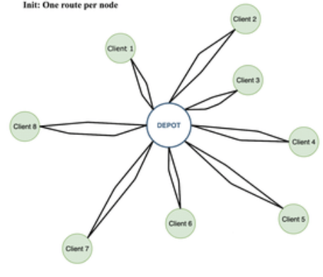
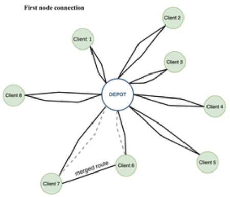
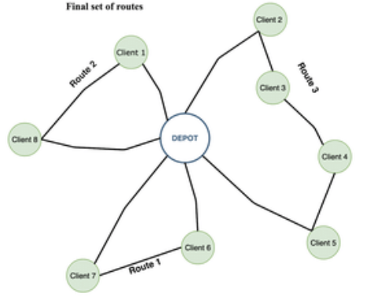

# Report

## **How To Run** 🏃🏻‍♂️
to run the file `solution.py` you'll need three parameters:  
• **arg1** : *absolute path of ampl environment*  
• **arg2** : *absolute path of the file model*  
• **arg3** : *absolute path of the data file*

the enter the command :
```
python3 solution.py arg1 arg2 arg3
```
in case you prefer not to enter parameters and set their values directly in the python code you can open the `solution.py` file and switch the comment between this lines of code and changing the values of strings to the required one:
``` python :
pathEnv = sys.argv[1]
pathModel = sys.argv[2]
pathData = sys.argv[3]
#pathEnv = "ABSOLUTE_PATH_AMPL_ENVIRONMENT"
#pathModel = "ABSOLUTE_PATH_FLP_MODEL.MOD"
#pathData = "ABSOLUTE_PARTH_DATA_FILE"
```
the flp_model.mod file is the one in this folder.

## **Heuristic Description** 📖
the problem has been splitted in two parts :  
• Facility Location Problem (FLP)  
• Vehicle Routing Problem (VRP)

we first solved the FLP using the AMPL Python libraries (Amplpy) and then applied an heuristic for the VRP on the optiomal solution found by AMPL.

### **Vehicle Routing Problem Heuristic** 🚚
we searched some option and at the end decided to use the Clarke-Wright Saving Algorithm.  
The basic idea of this approach is to initially dispatch a truck for each node.
  
Now we calculate the saving amount in case we use a truck for two nodes and merge.
  
At the end we'll have a solution like this.
  

### **Steps of Clarke-Writght Saving Algorithm** 🪜
*STEP 1*: calculate the savings `s(i, j) = d(depot, i) + d(depot, j) - d(i, j)` for every pair `(i, j)` of facility locations.  

*STEP 2*: sort the savings `s(i, j)` in descending order to have the largest saving at the top of the list.  

*STEP 3*: for the savings `s(i, j)` under consideration, include link `(i, j)` in a route if no route constraints will be violated through the inclusion of `(i, j)` in a route, and if:  
1) Either, neither `i` nor `j` have already been assigned to a route, in which case a new route is initiated including both `i` and `j`.

2) Or, exactly one of the two points `i` or `j` has already been included in an existing route and that point is not interior to that route (a point is interior to a route if it is not adjacent to the depot D in the order of traversal of points), in which case the link `(i, j)` is added to that same route.

3) Or, both `i` and `j` have already been included in two different existing routes and neither point is interior to its route, in which case the two routes are merged.

*STEP 4*: If the savings list `s(i, j)` has elements return to *STEP 3*, processing the next element in the list. Otherwise stop.

### Devs 💻
* 👩🏻‍💻 [Laura Amabili](https://github.com/LauraAmabili)
* 👨🏻‍💻 [Alfonso Catelli](https://github.com/itsAlfantasy)
